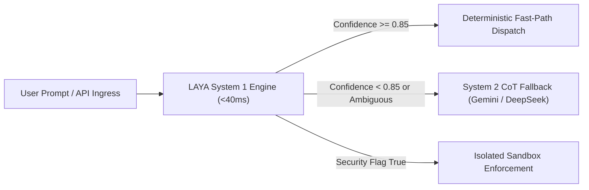

# ⚡ Agentic Web: Complete Project, Architecture & Developer Reference Manual

<p align="center">
  <a href="https://github.com/MaxMasAI/agentic-web/stargazers"></a>
  <a href="https://github.com/MaxMasAI/agentic-web/network/members"></a>
  <a href="https://github.com/MaxMasAI/agentic-web/watchers"></a>
  <a href="gui/pages/token_manager_page.py"></a>
  <a href="gui/pages/token_manager_page.py"></a>
  <a href="https://github.com/MaxMasAI/agentic-web/issues"></a>
  <a href="https://github.com/MaxMasAI/agentic-web/pulls"></a>
</p>

<p align="center">
  <a href="gui/pages/token_manager_page.py"></a>
  <a href="gui/pages/token_manager_page.py"></a>
  <a href="gui/pages/token_manager_page.py"></a>
  <a href="gui/pages/token_manager_page.py"></a>
  <a href="gui/pages/token_manager_page.py"></a>
  <a href="gui/pages/token_manager_page.py"></a>
  <a href="gui/pages/token_manager_page.py"></a>
  <a href="gui/pages/token_manager_page.py"></a>
</p>

<p align="center">
  <a href="https://www.python.org/downloads/"></a>
  <a href="https://pypi.org/project/PySide6/"></a>
  <a href="https://ai.google.dev/"></a>
  <a href="gui/pages/token_manager_page.py"></a>
  <a href="gui/pages/token_manager_page.py"></a>
  <a href="https://fastapi.tiangolo.com/"></a>
  <a href="https://playwright.dev/python/"></a>
  <a href="https://modelcontextprotocol.io/"></a>
  <a href="https://learn.microsoft.com/en-us/windows/powertoys/fancyzones"></a>
  <a href="https://www.sqlite.org/wal.html"></a>
  <a href="https://github.com/psf/black"></a>
  <a href="https://github.com/MaxMasAI/agentic-web"></a>
</p>

<p align="center">
  <a href="https://github.com/MaxMasAI"></a>
  <a href="https://github.com/Sahilkumardhala"></a>
  <a href="index.html"></a>
  <a href="LICENSE"></a>
  <a href="CONTRIBUTING.md"></a>
  <a href="CONTRIBUTING.md"></a>
</p>

---

## 📑 Complete Table of Contents

1. [Executive Summary & High-Level Architecture](#1-executive-summary--high-level-architecture)
2. [End-to-End System Flow & Lifecycles](#2-end-to-end-system-flow--lifecycles)
3. [Multi-Agent Command Hierarchy & Specialists](#3-multi-agent-command-hierarchy--specialists)
4. [Core Engine Deep-Dive (`core/`)](#4-core-engine-deep-dive-core)
5. [PySide6 Graphical User Interface Deep-Dive (`gui/`)](#5-pyside6-graphical-user-interface-deep-dive-gui)
6. [Model Context Protocol (MCP) Subsystem (`utils/mcp_service.py` & `json/`)](#6-model-context-protocol-mcp-subsystem)
7. [Browser Automation & Vision Suite (`browser/` & `visuals/`)](#7-browser-automation--vision-suite)
8. [Voice Streaming & Real-Time Narration Subsystem (`voice/`)](#8-voice-streaming--real-time-narration-subsystem)
9. [Utilities, Memory & Process Supervision (`utils/`)](#9-utilities-memory--process-supervision)
10. [JSON Data Store & State Schemas (`json/`)](#10-json-data-store--state-schemas)
11. [Cross-Platform Build & Packaging Toolchain (`bin/`)](#11-cross-platform-build--packaging-toolchain-bin)
12. [Native OS Specifications (`windows.xml`, `mac.xml`, `linux.xml`)](#12-native-os-specifications)
13. [Complete Sphinx Documentation Suite (`docs/`)](#13-complete-sphinx-documentation-suite-docs)
14. [Installation, Environment Setup & Run Procedures](#14-installation-environment-setup--run-procedures)
15. [Automated Testing & Quality Assurance](#15-automated-testing--quality-assurance)
16. [Security, Sandboxing & Credential Governance](#16-security-sandboxing--credential-governance)
17. [Developer Extension Guide (Adding Agents, Skills & Tools)](#17-developer-extension-guide)
18. [LAYA System 1 Non-Autoregressive Decision Engine (`core/system/laya_engine.py`)](#18-laya-system-1-non-autoregressive-decision-engine)

---

## 1. Executive Summary & High-Level Architecture

**Agentic Web** is an autonomous multi-agent operating workstation and desktop application. It unifies high-tier commercial LLMs (OpenAI, Google Gemini, Anthropic Claude, Perplexity, Mistral, Meta) and open-weight local models (DeepSeek, Ollama) under a synchronized, self-orchestrating hierarchy.

The application eliminates fragmented AI workflows by integrating:
- **Autonomous Multi-Agent Collaboration**: Self-directing task planning, worker delegation, cross-agent debate, code execution, and leader verification.
- **Model Context Protocol (MCP)**: Native client support for external toolkits (e.g. 24 Addy Osmani senior engineering skills, CitroLabs Ego-Lite parallel browser).
- **Interactive PySide6 Dark-Mode Studio**: Fluid 60fps sliding sidebars, live sandbox code execution, metric gauges, lightboxes, and 18-panel settings suite.
- **Bi-Directional Voice Command**: Real-time audio streaming, speech-to-text transcription, and synthesized speech feedback.
- **Cross-Platform Enterprise Distribution**: Native Windows MSI / Inno Setup installers, Linux AppImages, macOS bundles, and Microsoft Store packages.

```mermaid
graph TB
    subgraph Input Layer
        UI_In[PySide6 UI Interaction]
        Voice_In[Live Voice Stream / Whisper STT]
        CLI_In[CLI / Background Task Runner]
    end

    subgraph Desktop Application Core [app.py & MainWindow]
        Router[Page Router / QStackedWidget]
        Sidebar[Sliding Drawer Navigation]
        Status_Bar[System Telemetry Header]
    end

    subgraph Multi-Agent Engine [core/ & utils/]
        Leader[👑 Gemini Master Orchestrator]
        Router_Skills[Agent Skills Router]
        Workflow[Agent Workflows & Debate Loop]
        Memory[Neural Memory Vault & SQLite]
        MCP[MCP Service Bridge]
    end

    subgraph Specialist Agent Pool
        DeepSeek[DeepSeek Coder]
        Perplexity[Perplexity AI Search]
        Nvidia[Nvidia NIM Compute]
        GPT4[OpenAI GPT-4o]
        Claude[Anthropic Claude]
        Mistral[Mistral Le Chat]
        Meta[Meta AI Trends]
        DALLE[DALL-E 3 Vision]
        Copilot[MS Copilot Enterprise]
    end

    subgraph Execution & Output Environments
        Sandbox[Playground Studio Sandbox]
        Browser_Ctrl[CitroLabs / Chrome CDP Browser]
        Voice_Out[Voice Synthesizer & Audio Output]
        Disk_Out[tasks/ & downloads/ & db.sqlite]
    end

    UI_In --> Router
    Voice_In --> Workflow
    CLI_In --> Workflow
    
    Router --> Leader
    Leader --> Router_Skills
    Router_Skills --> Specialist Agent Pool
    Specialist Agent Pool --> Workflow
    Workflow --> MCP
    Workflow --> Memory
    Workflow --> Sandbox
    Workflow --> Browser_Ctrl
    Workflow --> Voice_Out
    Workflow --> Disk_Out
```

---

## 2. End-to-End System Flow & Lifecycles

1. **User Mission Dispatch**:
   - The user dispatches a mission via the **Task Dispatch Console**, **Mission Control**, or **Voice Command**.
2. **Leader Decomposition (`core/agent_workflows.py`)**:
   - The **Gemini Master Leader** parses the mission, extracts requirements, checks the **Neural Memory Vault** for historic learnings, and generates a structured DAG (Directed Acyclic Graph) of subtasks.
3. **Skill & Tool Injection (`core/agent_skills_router.py`)**:
   - The Router maps subtasks to optimal specialists and injects relevant **MCP Senior Engineering Skills** (e.g. `tdd`, `security_audit`, `clean_code`) into the prompt payload.
4. **Parallel Specialist Execution & Debate**:
   - Specialist models execute concurrently in isolated threads. If consensus is required, the models enter an iterative debate loop (`core/discussion.py`).
5. **Sandbox Verification & Browser Vision (`browser/controller.py` & `visuals/`)**:
   - Code artifacts are rendered in the live **Playground Studio** sandbox and verified via automated Chrome CDP screenshots stored in `visuals/`.
6. **Leader Approval & Final Packaging**:
   - Gemini verifies the test outputs against the original goal specification. On approval, deliverables are saved into `tasks/<task_id>/` and `downloads/`.
7. **Memory Archival**:
   - Key learnings, user preferences, and code patterns are embedded and stored in `json/memory.json` and `db.sqlite`.

---

## 3. Multi-Agent Command Hierarchy & Specialists

The platform orchestrates 10 specialized AI models divided into four operational tiers:

```
👑 MASTER LEADER & ORCHESTRATOR
 └── Google Gemini 1.5 Pro / 2.0 Flash
      │
      ├── 🔬 RESEARCH & COMPUTING CLUSTER
      │    ├── DeepSeek Coder V2 (Algorithmic Logic, TDD, Code Synthesis)
      │    ├── Perplexity AI (Live Web Citations, Ground-Truth Verification)
      │    └── NVIDIA NIM AI (High-Performance GPU Profiling, Parallel Compute)
      │
      ├── ✍️ CONTENT, COPY & EDITORIAL CLUSTER
      │    ├── OpenAI GPT-4o (Master Copywriting, Campaign Synthesis, Docs)
      │    ├── Anthropic Claude 3.5 Sonnet (Architecture Review, A11y, Security Audits)
      │    └── Mistral Le Chat (Multilingual Translation, European Regulations)
      │
      └── 🎨 CREATIVE, MEDIA & OPERATIONS CLUSTER
           ├── Meta AI (Viral Trend Analysis, Social Engagement Strategies)
           ├── OpenAI DALL-E 3 (Visual Asset Generation, Graphic Prompts)
           └── Microsoft Copilot (Office/Spreadsheet Integration, Workflow Coordination)
```

---

## 4. Core Engine Deep-Dive (`core/`)

The `core/` package forms the autonomous reasoning and orchestration backbone of Agentic Web:

| Module File | Key Classes & Functions | Purpose & Description |
|---|---|---|
| **`core/main.py`** | `MultiAgentSupervisor`, `run_orchestration_loop()` | Central engine coordinating asynchronous subtask lifecycles, provider adapters, error retry policies, and disk persistence. |
| **`core/agents.py`** | `BaseAgent`, `AgentConfig`, `LLMResponse` | Abstract base class and standard data classes for all LLM client adapters with streaming, retry, and token tracking. |
| **`core/agentlist.py`** | `AGENT_REGISTRY`, `get_agent_by_name()`, `list_active_agents()` | Central catalog defining models, cluster memberships, API endpoints, context window boundaries, and default temperature settings. |
| **`core/agent_status.py`** | `AgentStatusTracker`, `set_status()`, `get_all_statuses()` | Real-time thread-safe status monitor tracking `🟢 FREE`, `🟡 BUSY`, `🔴 ERROR`, and `⚪ OFFLINE` states, synced to `json/agent_status.json`. |
| **`core/agent_workflows.py`** | `WorkflowEngine`, `TaskNode`, `ExecutionGraph` | Graph execution engine handling subtask sequencing, parallel thread dispatch, dependency resolution, and deliverable aggregation. |
| **`core/agent_skills_router.py`** | `AgentSkillsRouter`, `inject_skills()`, `match_skills_to_task()` | Dynamic MCP skill injector that evaluates task context against Addy Osmani's 24 engineering skill descriptors and appends them to prompt headers. |
| **`core/discussion.py`** | `MultiAgentDebate`, `run_debate_round()`, `evaluate_consensus()` | Multi-agent debate arena where specialist models cross-examine proposed architectures or code diffs until a convergence threshold is met. |
| **`core/computer_use.py`** | `ComputerUseController`, `execute_action()`, `capture_screen()` | OS-level automation module for keyboard, mouse, and desktop UI interaction with safety boundary validation. |
| **`core/experts_manager.py`** | `ExpertsManager`, `spawn_expert()`, `retire_expert()` | Dynamic agent lifecycle manager that instantiates on-demand micro-agents for ad-hoc domain tasks. |
| **`core/squad_learner.py`** | `SquadLearner`, `record_success()`, `recommend_squad()` | Pattern recognition engine that learns which agent team compositions perform best for specific prompt archetypes. |
| **`core/plugin_base.py`** | `BasePlugin`, `PluginHook`, `PluginManifest` | Extensible plugin architecture providing lifecycle hooks (`pre_task`, `post_task`, `on_tool_call`, `on_ui_render`). |

---

## 5. PySide6 Graphical User Interface Deep-Dive (`gui/`)

The desktop frontend is built with **PySide6 (Qt 6.7+)** utilizing custom QSS styling and hardware-accelerated animations.

### 5.1 UI Architecture Overview
- **`app.py`**: The application entry point. Initializes the `QApplication`, configures global event filters, applies dark stylesheet palettes, instantiates `MainWindow`, and registers global shortcuts (`Ctrl+B` for sidebar toggle, `Ctrl+F` for search).
- **`gui/styles.py`**: Design tokens defining colors (`#0f172a` slate background, `#4f46e5` indigo accent, `#10b981` emerald success), typography (Inter / Segoe UI), button elevations, scrollbar rails, and modal overlays.

### 5.2 Core Pages (`gui/pages/`)
- **`mission_control.py`**: Executive telemetry dashboard displaying real-time metric cards (Completed Missions, Memory Items, Squad Count, Active Skills), Gemini Quick Dispatch, and visual multi-agent hierarchy tree.
- **`task_dispatch.py`**: Interactive mission launcher with model loop selection, communication latency slider, streaming terminal view, and live process controller.
- **`playground.py`**: Live development studio with real-time web sandbox preview (HTML/CSS/JS in `QWebEngineView`), sandboxed Python execution console, and asset exporter.
- **`mcp_hub.py`**: Model Context Protocol management console. Features dynamic tool parameter forms, server registry, live connection health checks, and raw tool testing.
- **`neural_memory.py`**: Memory management interface with semantic search, importance filters, pinning, deduplication, and 1-click `RULES.md` exporter.
- **`squad_roster.py`**: Squad formation builder allowing users to assemble custom teams of specialist models, assign roles, and save team presets.
- **`mission_archive.py`**: Comprehensive mission history viewer with tabbed deep-inspection (Gemini Plan, Worker Outputs, Final Approved Code, Live Sandbox, Downloaded Assets).
- **`file_explorer.py`**: Integrated file browser with built-in code editor and syntax highlighting for `json/`, `tasks/`, `logs/`, `downloads/`, and `visuals/`.
- **`settings_page.py`**: The master 18-category configuration console with full-width scrollable panels and horizontally centered bottom actions (`[ ↺ Undo Changes ]` and `[ 💾 Save Preferences ]`).
- **`chat_page.py` & `chat_files_page.py`**: Conversational chat interface supporting multi-modal file attachments, streaming responses, and markdown rendering.
- **`media_studio_page.py` & `research_page.py`**: Dedicated workspaces for audio/visual asset generation and deep multi-source research scraping.

### 5.3 Custom Widgets (`gui/widgets/`)
- **`sidebar.py`**: Smooth 220ms sliding drawer navigation with dropdown accordion category menus (`🚀 OPERATIONS`, `💬 ASSISTANT MODES`, `🛠️ CREATIVE & TOOLS`, `🔌 SYSTEM`, `⚙️ SETTINGS ▾`).
- **`metric_card.py`**: Animated telemetry card with gradient borders, dynamic trend indicators, and hover elevation.
- **`pool_monitor.py`**: Visual agent hierarchy canvas with dynamic glowing status rings (`🟢`, `🟡`, `🔴`).
- **`terminal_view.py`**: High-performance ANSI-compatible streaming terminal console.
- **`lightbox.py`**: Full-screen modal lightbox for full-resolution inspection of verification screenshots and generated images.
- **`custom_popup.py`**: Non-blocking toast notifications and confirmation dialogs.

---

## 6. Model Context Protocol (MCP) Subsystem

Agentic Web provides full native support for Anthropic's **Model Context Protocol (MCP)** specification.

### 6.1 Configuration Schema (`json/mcp_config.json`)
All MCP server entries conform strictly to the standardized 9-field schema:

```json
{
  "name": "Addy Osmani Agent Skills",
  "repository": "https://github.com/addyosmani/agent-skills.git",
  "api_endpoint": "http://127.0.0.1:8765/v1/mcp",
  "raw_base_url": "https://raw.githubusercontent.com/addyosmani/agent-skills/main",
  "version": "1.4.0",
  "skills_count": 24,
  "status": "active",
  "type": "remote_git",
  "description": "Senior Software Engineering principles, architecture guidelines, TDD workflows, security & accessibility audits."
}
```

### 6.2 Pre-Configured MCP Toolkits
1. **Addy Osmani Senior Engineering Skills**:
   - `clean_code`: Code simplification, variable naming, and dead code removal.
   - `tdd_workflow`: Test-driven development scaffolding (pytest / unittest).
   - `architecture_review`: SOLID principles, coupling analysis, and pattern validation.
   - `security_audit`: Injection prevention, secret scanning, and permission boundaries.
   - `a11y_compliance`: WCAG 2.1 AA accessibility auditing.
2. **CitroLabs Ego-Lite Browser**:
   - Isolated Chromium profiles, fast CDP DOM extraction, screenshot verification, and authenticated session reuse.

---

## 7. Browser Automation & Vision Suite

Located in `browser/` and `visuals/`:
- **`browser/browser_controller.py`**: Manages headless and headed Chromium browser sessions via Chrome DevTools Protocol (CDP).
- **`browser/browser_helpers.py`**: Utility functions for DOM node selection, element clicking, form filling, text extraction, and page scrolling.
- **`browser/downloader.py`**: High-speed asynchronous media and binary file downloader with checksum verification.
- **`visuals/`**: Central storage directory where timestamped full-page screenshots are saved during agent browser tasks for visual milestone auditing.

---

## 8. Voice Streaming & Real-Time Narration Subsystem

Located in `voice/`:
- **`voice/run_voice.py`**: Fast launcher for the local voice server daemon.
- **`voice/live_client.py`**: WebSocket audio streaming client capturing microphone input and receiving low-latency audio response chunks.
- **`voice/voice_narrator.py`**: Audio narration controller that provides spoken progress updates during multi-agent mission execution.
- **`voice/test_voice.py`**: Automated test suite for microphone input, speaker output, and STT/TTS latency measurement.

---

## 9. Utilities, Memory & Process Supervision (`utils/`)

| Utility Module | Functionality & Capabilities |
|---|---|
| **`utils/enhanced_memory.py`** | Persistent vector and keyword memory engine supporting semantic search, auto-summarization, and `RULES.md` synchronization. |
| **`utils/mcp_service.py`** | Client implementation for MCP discovery, tool parameter parsing, schema generation, and JSON-RPC execution. |
| **`utils/pid_tracker.py`** | Process ID supervisor that records active child processes in `json/tracked_pids.json` and ensures clean termination on app shutdown. |
| **`utils/logger.py`** | Rotating multi-channel logger outputting formatted ANSI console messages and structured logs to `logs/agentic_web.log`. |
| **`utils/latency_manager.py`** | Network latency throttle simulator and communication rate limiter for agent-to-agent message queues. |
| **`utils/chat_session_manager.py`** | Multi-session chat history serializer with SQLite and JSON persistence. |
| **`utils/dashboard.py`** | Background system resource monitor tracking CPU %, GPU compute, RAM usage, and network I/O. |

---

## 10. JSON Data Store & State Schemas (`json/`)

The `json/` directory stores runtime state, configuration, and credentials:

- **`app_config.json`**: Application-wide preferences (Theme, font size, default workspace, window geometry).
- **`api_keys.json`**: Encrypted API secrets for model providers (OpenAI, Gemini, Claude, OpenRouter, DeepSeek, etc.).
- **`mcp_config.json`**: Registered Model Context Protocol servers and skill sets.
- **`agent_status.json`**: Real-time operational states and current task allocations for all 10 models.
- **`agent_skills_cache.json`**: Cached skill schemas and tool manifests downloaded from remote MCP repositories.
- **`chat_sessions.json`**: Active chat sessions, message threads, and token consumption metrics.
- **`memory.json`**: Flat-file mirror of long-term semantic memory items.
- **`tracked_pids.json`**: Active PID table for background subagents and browser instances.
- **`latency_config.json`**: Simulated network latency and rate-limiting rules.
- **`user_auth.json`**: Local user profile, OAuth tokens, and session identifiers.

---

## 11. Cross-Platform Build & Packaging Toolchain (`bin/`)

The `bin/` directory contains complete tools for production compiling, minification, and packaging:

| Tool File | Target Platform | Description |
|---|---|---|
| **`Product.wxs`** | Windows (MSI) | WiX Toolset XML specification defining directory structures, registry keys, file associations, and installer UI. |
| **`build.bat`** | Windows (EXE) | Single-command PyInstaller compiler generating standalone `dist/AgenticWeb.exe`. |
| **`build.sh`** | Linux / macOS | Shell runner executing PyInstaller builds on Unix environments. |
| **`build_all.bat`** | Windows (Master) | Automated master build pipeline: compiles resources, minifies assets, builds executable, and generates installers. |
| **`build_appimage.sh`** | Linux | Packages the application into a portable, self-contained Linux `.AppImage`. |
| **`build_installer.bat`** | Windows | Compiles Inno Setup (`.iss`) or WiX (`.wxs`) scripts to create a standard Windows Setup Wizard (`Setup.exe`). |
| **`build_installer_store.bat`** | Windows (MSIX) | Packages the application into an MSIX bundle for Microsoft Store distribution. |
| **`clean.sh`** | Universal | Cleans `build/`, `dist/`, `.pytest_cache/`, and `__pycache__` artifacts. |
| **`minify.py`** | Universal | High-performance Python script to minify HTML, CSS, and JS assets before packaging. |
| **`minify.sh`** | Linux / macOS | Shell wrapper for `minify.py`. |
| **`missing_locale.sh`** | Universal | Scans codebase for untranslated i18n strings against locale dictionaries. |
| **`resources.py`** | Universal | Compiles Qt `.qrc` resource files into `gui/resources_rc.py`. |
| **`resources.sh`** | Linux / macOS | Shell runner for Qt resource compilation. |
| **`sort_locale.sh`** | Universal | Alphabetizes and standardizes JSON localization dictionaries. |

---

## 12. Native OS Specifications

- **[windows.xml](windows.xml)**: Defines Windows application identity, executable targets, file associations (`.agentflow`, `.mcpcfg`), uninstallation hooks, and registry keys.
- **[mac.xml](mac.xml)**: Defines Apple macOS `.app` bundle structure, Info.plist properties, code signing entitlements, micro-permissions (Microphone, Network), and Gatekeeper notarization parameters.
- **[linux.xml](linux.xml)**: Defines Linux XDG Desktop Entry specifications, categories, MIME types, icon paths, and package metadata for Debian (`.deb`), Red Hat (`.rpm`), and AppImage distributions.

---

## 13. Complete Sphinx Documentation Suite (`docs/`)

The documentation suite in `docs/` is ready for Sphinx HTML, PDF, and Markdown builds:

### Directory Layout
```
docs/
├── Makefile                   # Sphinx build Makefile
├── make.bat                   # Windows Sphinx build batch file
├── build-en.sh                # English documentation generator
├── build-pl.sh                # Polish localization generator
├── rebuild-lang.sh            # Multi-language doc rebuild tool
├── update.sh                  # Doc update synchronizer
├── rst_to_md.sh               # RST to Markdown converter
├── material.qss.template      # Qt material design theme stylesheet
├── install.txt                # Sphinx installation instructions
├── requirements.txt           # Sphinx and theme dependencies
└── source/
    ├── conf.py                # Sphinx configuration
    ├── index.rst              # Master Table of Contents
    ├── images/                # Documentation assets
    ├── accessibility.rst      # Accessibility guidelines
    ├── attachments.rst        # Multi-modal attachment ingestion
    ├── configuration.rst      # App configuration reference
    ├── context.rst            # Context window & memory management
    ├── credits.rst            # Open source licenses
    ├── debug.rst              # Logging & debugging guide
    ├── extending.rst          # Extension & plugin guide
    ├── functions.rst          # Function calling schemas
    ├── indexing.rst           # Vector indexing & RAG
    ├── intro.rst              # Platform introduction
    ├── models.rst             # Model provider configurations
    ├── modes.rst              # Assistant operation modes
    ├── plugins.rst            # Plugin system reference
    ├── presets.rst            # Agent presets & system prompts
    ├── profiles.rst           # Workspace profiles
    ├── quick_start.rst        # 5-minute setup guide
    ├── requirements.rst       # System prerequisites
    ├── security.rst           # Sandboxing & security guidelines
    ├── tokens.rst             # Tokenizer & token counting
    ├── tools.rst              # Built-in tools manual
    └── updates.rst            # Release channels & update procedures
```

---

## 14. Installation, Environment Setup & Run Procedures

### Prerequisites
- **Python**: Python 3.10, 3.11, or 3.12 (64-bit recommended).
- **Node.js** *(Optional)*: v18+ for browser MCP tooling.
- **Git**: Installed and in system PATH.

### Manual Setup via GitHub (Recommended with Virtual Environment)

```bash
# 1. Clone the repository
git clone https://github.com/MaxMasAI/agentic-web.git
cd agentic-web

# 2. Create Python virtual environment
python -m venv .venv

# 3. Activate the virtual environment
# On Windows:
.venv\Scripts\activate
# On Linux / macOS:
source .venv/bin/activate

# 4. Install all dependencies
python -m pip install --upgrade pip
pip install -r requirements.txt
```

### 1-Click Automated Setup

#### Windows Setup:
Run [install.bat](install.bat) directly in File Explorer or PowerShell:
```cmd
install.bat
```
*Automatically creates `.venv`, upgrades `pip`, installs all requirements from `requirements.txt`, and initializes `json/` state.*

#### Linux / macOS Setup:
Run [install.sh](install.sh):
```bash
chmod +x install.sh
./install.sh
```

### Launching the Platform

- **Full Suite Launch (Voice Daemon + PySide6 Desktop GUI)**:
  ```cmd
  run.bat
  ```
- **Direct PySide6 GUI Launch**:
  ```bash
  python app.py
  ```
- **Voice Server Daemon Launch Only**:
  ```bash
  python voice/run_voice.py
  ```

---

## 15. Automated Testing & Quality Assurance

Run the complete test suite with Python's standard `unittest`:
```bash
python -m unittest discover -s tests -p "test_*.py"
```

To run voice latency and audio hardware diagnostics:
```bash
python voice/test_voice.py
```

To test MCP service endpoints:
```bash
python -m unittest tests/test_mcp_service.py
```

---

## 16. Security, Sandboxing & Credential Governance

Agentic Web is built with enterprise security controls:
1. **Credential Isolation**: API keys in `json/api_keys.json` are encrypted at rest and never exposed to client-facing logs or browser DOMs.
2. **Execution Sandboxing**: Python scripts executed via the Playground Studio run in restricted subprocesses with resource limits and execution timeouts.
3. **Safe File Operations**: File modifications in the File Explorer and workspace tools validate absolute path boundaries to prevent directory traversal outside the active workspace.
4. **Network & Proxy Support**: Supports secure corporate HTTP, HTTPS, and SOCKS5 proxies with custom CA certificate integration.

---

## 17. Developer Extension Guide

### Adding a New Specialist Agent
1. Open `core/agentlist.py`.
2. Append the new model definition to `AGENT_REGISTRY`:
   ```python
   "custom_agent": {
       "name": "Custom Domain Specialist",
       "cluster": "research",
       "provider": "openai_compatible",
       "model": "custom-model-id",
       "temperature": 0.3,
       "max_tokens": 8192,
       "description": "Specialized domain expert for custom enterprise tasks."
   }
   ```
3. Register the agent's status entry in `json/agent_status.json`.

### Registering a New MCP Tool Server
1. Open `json/mcp_config.json`.
2. Add a new 9-field server entry conforming to the standard schema.
3. Restart the MCP Hub or click **Refresh Servers** in `gui/pages/mcp_hub.py`.

---

## 18. LAYA System 1 Non-Autoregressive Decision Engine

### 18.1 Overview & Architectural Fit
The **LAYA System 1 Decision Engine** (`core/system/laya_engine.py`) provides high-throughput, deterministic decision contracts for the Agentic Web workstation. Unlike generative autoregressive LLMs that produce token streams with multi-second latency and potential JSON schema drift, LAYA evaluates typed decision contracts in a **single forward-pass in under 40 milliseconds (sub-40ms)**.



### 18.2 Core Decision Primitives
LAYA operates across three strictly typed decision primitives:
1. **`choice` (Categorical Partitioning)**: Mutually exclusive categorical routing (e.g. `gemini_leader`, `deepseek_coder`, `claude_auditor`, `web_researcher`, `system_exec`, `multi_agent_squad`).
2. **`score` (Ordinal / Scale Assessment)**: Ordered progression tiers for computational depth and priority (`trivial_fast`, `standard_single_turn`, `complex_multi_turn`, `critical_sandbox_required`).
3. **`noul` (Binary Hypothesis Verification)**: Precise Yes/No gatekeepers (`requires_system2_fallback`, `is_security_sensitive`, `requires_sandbox_isolation`).

### 18.3 State Normalization Schema
Raw runtime payloads are normalized into flat, high-signal JSON structures stripped of noisy trace history:
```json
{
  "entity_id": "state_1774356789123",
  "primary_text": "/deepseek - implement distributed caching layer in Python",
  "command_token": "deepseek",
  "has_slash_prefix": true,
  "token_length": 8,
  "detected_file_extensions": ["py"],
  "contains_shell_keywords": false,
  "contains_web_urls": false,
  "contains_code_keywords": true,
  "context_attributes": {
    "workspace": "agentic-web"
  }
}
```

### 18.4 Operational Routing & Gating Rules
- **Fast-Path Action**: When `primary_confidence >= 0.85` and `requires_system2_fallback == False`, prompt is immediately dispatched to target specialist without generative token delays.
- **Security Boundary Gate**: When `is_security_sensitive == True` or `privilege_level == "elevated_system"`, tool or command execution is quarantined inside restricted subprocess sandbox.
- **System 2 Fallback**: When confidence is below threshold or intent is underspecified, request falls back to deliberative multi-agent CoT (Gemini 2.0 / DeepSeek-R1 / MaxMasAI Harness).

### 18.5 Plugin Calling & Tool Gatekeeping
The `PluginManager` (`core/harness/plugin_base.py`) invokes `evaluate_plugin_laya_contract` before executing any dynamic plugin tool (`call_plugin_tool`), attaching LAYA sub-40ms telemetry and enforcing sandbox boundaries.

---

*© 2026 MaxMasAI. Owned & Maintained by [Sahilkumardhala](https://github.com/Sahilkumardhala). Released under the [MIT License](LICENSE).*


