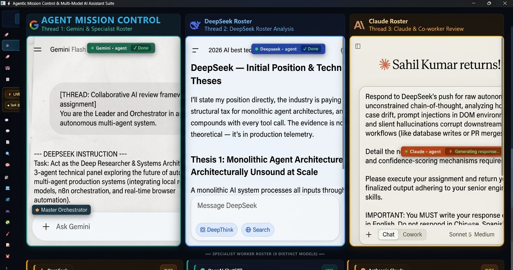
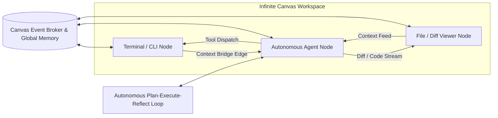

# ⚡ Agentic Web: Autonomous Multi-Agent Desktop Operations Platform

> **Organization**: [MaxMasAI](https://github.com/MaxMasAI)  
> **Owner & Creator**: [Sahil Kumar Dhala](https://github.com/Sahilkumardhala)  
> **License**: [MIT License](LICENSE)  

An enterprise-grade autonomous multi-agent operating system and native **PySide6 Desktop Application** designed for synchronized AI model orchestration, dynamic Model Context Protocol (MCP) tool execution, senior engineering skill integration, and real-time live voice control.

---

## 🎬 Live Demonstration Video

<div align="center">
  <video src="images/demo.mp4" width="100%" controls="controls" poster="images/000_web_agent.png">
    Your browser does not support the video tag.
  </video>
  <p><i>🎥 <b>Watch the Full Multi-Agent Workflow & Desktop Operations Demo:</b> <a href="images/demo.mp4"><code>images/demo.mp4</code></a></i></p>
</div>

---

## 🌟 Key Architecture & Capabilities

### 👑 1. Multi-Agent Command Hierarchy (10 Active Models)
- **👑 Master Leader & Orchestrator:**
  - **Google Gemini**: Decomposes user missions into atomic subtasks, assigns work equally across available specialist models, and conducts final editorial approval.
- **🔬 Research & Technical Computing Cluster:**
  - **DeepSeek**: Creative ideation, algorithmic design, and test-driven code implementation.
  - **Perplexity AI**: Real-time factual citations and live web knowledge verification.
  - **Nvidia NIM AI**: High-performance GPU compute advisor and web performance profiling.
- **✍️ Content, Copy & Editorial Cluster:**
  - **OpenAI ChatGPT (GPT-4o)**: Campaign synthesis, client copywriting, and document packaging.
  - **Anthropic Claude**: Editorial review, security boundary auditing, and accessibility audits.
  - **Mistral Le Chat**: European multilingual translation and logic verification.
- **🎨 Creative, Media & Operations Cluster:**
  - **Meta AI**: Viral trend analysis and platform engagement optimization.
  - **OpenAI DALL-E 3**: Graphic asset design, composition, and visual prompt engineering.
  - **Microsoft Copilot**: Enterprise workflow coordination and office document integration.

---

## 🔌 2. Model Context Protocol (MCP) Subsystem
- **Addy Osmani Agent Skills (`https://github.com/addyosmani/agent-skills.git`)**:
  - Live remote integration connecting 24 senior engineering skills (Spec-Driven Development, TDD, Architectural Review, Code Simplification, Security & A11y Audits).
  - Dynamically injected into each agent's execution prompt according to their task role.
- **CitroLabs Ego-Lite Parallel Browser (`https://github.com/citrolabs/ego-lite.git`)**:
  - Isolated Chromium spaces, authenticated Chrome session reuse, and high-speed CDP DOM extraction.
- **Standardized 9-Field Schema**:
  - All MCP configurations in `json/mcp_config.json` conform strictly to the 9-field schema (`name`, `repository`, `api_endpoint`, `raw_base_url`, `version`, `skills_count`, `status`, `type`, `description`).

## 🖥️ 3. Futuristic PySide6 Desktop Console
- **🛰️ Mission Control (Home):** Interactive telemetry cards (`Tasks Completed`, `Memory Items`, `Squad Roster`, `Agent Skills`, `Assets Saved`, `Active Missions`), Gemini Direct Task Dispatcher, and real-time Multi-Agent Hierarchy Monitor.
- **🌳 Agent Command Hierarchy Tree:** Switchable tree & grid view with Gemini Leader at the root branching into the specialist clusters with live `🟢 FREE` vs `🟡 BUSY` indicators and agent activity inspector.
- **🚀 Task Dispatch Console:** Custom agent loop selector, latency & communication speed tuner, real-time streaming log terminal, and process manager.
- **🎮 Playground Studio:** Live HTML/CSS/JS sandbox with real-time deliverable preview, isolated Python execution sandbox, and task code extractor.
- **🤖 Agent Squads:** Autonomous AI Squad generator based on project scope, 1-click fast presets, and repeated pattern auto-learner.
- **📋 Mission Archive:** Searchable mission history with 5 deep inspection tabs (Gemini Plan, Worker Outputs, Final Approved Result, Live Sandbox, Downloaded Assets) and full-resolution screenshot lightboxes.
- **📁 Folder Explorer:** Direct inline code inspector and preview for `json/`, `tasks/`, `logs/`, `downloads/`, `visuals/`, and `plugins/` with safe file deletion protection.
- **🔌 MCP Service Hub:** Live tool tester with dynamic parameter forms, server registry, parameter schema explorer, and custom server registration.
- **🧠 Neural Memory Vault:** Cross-mission factual memory search, semantic categorization, importance rating, pin priority, deduplication, and `RULES.md` exporter.

---

## 🌌 4. Autonomous Infinite Canvas IDE (October.dev Architecture)

An interactive 2D infinite workspace for autonomous multi-agent development workflows:



- **Interactive Node System**:
  - `🖥️ Terminal / CLI Node`: Embedded live shell running command-line workflows with exit code indicators and real-time stream output.
  - `🤖 Autonomous Agent Node`: Autonomous LLM worker with objective input, dynamic status badges (`IDLE`, `PLANNING`, `EXECUTING`, `PAUSED`, `ERROR`), and tool execution feeds.
  - `📄 File / Diff Viewer Node`: Unified git-style diff viewer (`+` green additions, `-` red deletions) with live code editing and save triggers.
  - `⚡ Context Bridge (Bézier Wires)`: Directed data pipelines linking terminal output streams, agent context buffers, and file diff emitters.
- **Autonomous Tool-Calling Loop**:
  - `run_command(cmd)`: Dispatches execution to connected CLI terminal nodes.
  - `read_file(path)` / `write_file(path, content)`: Updates workspace storage and emits live diffs to connected File nodes.
  - `spawn_node(type, props)`: Dynamically adds dependent sub-agents or utility nodes directly onto the canvas.


## 📸 Visual Interface & Platform Showcase

### 🛰️ 1. Mission Control Dashboard

* **Clarification**: Central telemetry command center providing real-time metrics (`Tasks Completed`, `Memory Items`, `Squad Roster`, `Agent Skills`, `Active Missions`), multi-agent command hierarchy status, and 1-click quick-action dispatchers.

---

### 🚀 2. Task Dispatch Console & Live Telemetry Monitor

* **Clarification**: Configure mission parameters, tune inter-agent communication latency (Turbo, Balanced, Paced, or Custom sliders), inspect real-time multi-agent streaming terminal output, and manage active background processes.

---

### 💻 3. Inbuilt VS Code Monaco Studio & Live Preview

* **Clarification**: Embedded full-featured Monaco Code Studio with multi-tab file management, project directory tree, dual-pane live web & markdown preview, syntax highlighting for 12+ languages, auto-save, and formatting controls.

---

### 🌌 4. Autonomous Infinite Canvas IDE (DAG Workflow Architecture)

* **Clarification**: Interactive 2D infinite workspace (inspired by October.dev) connecting Terminal CLI nodes, Autonomous Agent workers, and Git-style Diff nodes via directed Bézier context wires for complex multi-agent pipelines.

---

### 🔌 5. Model Context Protocol (MCP) Server Hub

* **Clarification**: Centralized MCP server management interface with live tool parameter execution testing, 9-field JSON schema verification, and dynamic connection to Addy Osmani Senior Engineering Skills.

---

### 🧠 6. Semantic Neural Memory Bank & Knowledge Vault

* **Clarification**: Persistent cross-mission memory bank storing key architectural decisions, design conventions, and prompt refinements with search, categorization, importance weighting, and `RULES.md` export.

---

### 🌐 7. Multi-Agent Browser Automation & Window Focus Controls

* **Clarification**: Real-time multi-agent browser viewport and session control center featuring live CDP connection indicators, active browser tab switchers with window focus buttons, multi-agent cursor trackers (Gemini, DeepSeek, Claude, Web-Agent, and OS System Cursor), live screenshot capture triggers, and session recording tools.

---

### 🤖 8. Live Collaborative Multi-Agent Workflow & Window Focus HUD

* **Clarification**: Real-time collaborative pipeline HUD visualizing all active agent pills, execution status badges (`Working...`, `Done`, `Queued`), smooth horizontal card navigation, and 1-click `👁️ View Tab` window focus controls.

---

## 📁 Directory Structure

| Directory | Purpose |
|---|---|
| **`gui/`** | PySide6 Desktop UI architecture (Theme, Widgets, Pages). |
| **`json/`** | Centralized storage for MCP configs, agent status, squads, memories, and PID queues. |
| **`tasks/`** | Historical task archives, subtask breakdowns, debate logs, and deliverables. |
| **`logs/`** | Real-time console logs, telemetry streams, and system diagnostics. |
| **`downloads/`** | Generated images, code bundles, and client assets auto-downloaded from agents. |
| **`visuals/`** | Browser verification screenshots captured at each execution milestone. |
| **`tests/`** | Automated unit tests for MCP services, agent status, and skills router. |

---

## 🚀 Quick Start & Installation via GitHub

### 1. Clone the Repository
```bash
git clone https://github.com/MaxMasAI/agentic-web.git
cd agentic-web
```

### 2. Create & Activate Python Virtual Environment (`.venv`)
> [!TIP]
> Always create an isolated virtual environment to prevent dependency conflicts with system packages.

#### On Windows (PowerShell / Command Prompt):
```powershell
# Create the virtual environment
python -m venv .venv

# Activate the virtual environment
.venv\Scripts\activate

# Upgrade pip and install all dependencies
python -m pip install --upgrade pip
pip install -r requirements.txt
```

#### On macOS & Linux (Bash / Zsh):
```bash
# Create the virtual environment
python3 -m venv .venv

# Activate the virtual environment
source .venv/bin/activate

# Upgrade pip and install all dependencies
python -m pip install --upgrade pip
pip install -r requirements.txt
```

*(Alternatively, Windows users can simply run `install.bat` and Unix users can run `./install.sh` to automate this entire process).*

---

### 3. Launch the Application

> [!TIP]
> **💡 Launcher Recommendation:**
> - **If you are coding / customizing**: Double-click **`dev.bat`** (Live Auto-Reload mode: automatically restarts on `Ctrl+S`).
> - **If you are just using the app**: Double-click **`run.bat`** (Standard run mode with Gemini Voice daemon).

#### Launch Full Suite (Voice Server Daemon + PySide6 Desktop GUI):
```cmd
run.bat
```

#### Launch Desktop GUI Directly:
```bash
python app.py
```

#### ⚡ Live Auto-Reload Development Mode (Auto-restarts on code edits):
```bash
# Using watchmedo directly
watchmedo auto-restart --directory=. --pattern="*.py" --recursive -- python main.py

# Or using the built-in dev runner / batch file:
python dev.py          # Auto-reloads app.py on code edits (GUI)
python dev.py --cli    # Auto-reloads main.py on code edits (CLI)
dev.bat                # Windows 1-click dev launcher
```

### 4. Run Test Suites
```bash
python -m unittest discover tests
```

## 🐳 5. Run with Docker Compose
If you prefer containerized execution, you can run the app seamlessly using the provided `docker-compose.yml`.

```bash
docker compose up --build
```
*(Note: Since this is a GUI application, it automatically passes your host's X11 server socket. This is primarily supported on Linux/WSL).*

---

## 📦 6. Build Standalone Executable
You can easily compile Agentic Web into a standalone, portable Windows executable (`.exe`) that doesn't require Python or virtual environments!

1. Open your terminal in the project root.
2. Run the executable builder:
```bash
python STD_EXE.py
```
3. Your portable app will be generated in `dist/agentic-web/`. You can simply double-click `agentic-web.exe` to start the dashboard!

---

## ⚙️ Configuration & Agent Roster Customization

- **`json/agent_status.json` / `json/subagents.json`**: Configure default squad models, fallback chains, temperature profiles, and prompt instructions.
- **Hierarchy Switcher**: Toggle between **Tree Hierarchy Format** and **Symmetrical Grid Format** directly from the UI header to optimize display for your monitor size.
- **System App Launcher**: Directly launch native Windows desktop utilities (`notepad`, `task manager`, `calc`, `vscode`, `settings`) without triggering search fallbacks.

---

## ❓ Frequently Asked Questions (FAQ)

### 🌐 General & Architecture

* **What is Agent Mission Control?**  
  It is a desktop operations console and dashboard designed to orchestrate, monitor, and synchronize autonomous multi-model AI workflows (Gemini, DeepSeek, Claude, ChatGPT, and Local LLMs) from a single unified interface.

* **How does the Leader-Worker agent hierarchy work?**  
  The system designates a primary model (e.g., Google Gemini as Master Orchestrator) to analyze complex prompts, decompose objectives into atomic subtasks, and dispatch them to specialized worker agents (like DeepSeek for deep research/code, Claude for editorial nuance, and ChatGPT for copywriting).

* **Can I run tasks across multiple browser sessions and API calls simultaneously?**  
  Yes. The application supports real-time multi-agent live pooling, split-pane DOM browser automation (via Chrome CDP on port 9222), and concurrent headless API endpoints, allowing parallel execution across distinct AI providers.

---

### 🔑 Setup & Configuration

* **Do I need API keys or web sessions to run the agents?**  
  The app supports both direct API credentials and session-based browser automation (e.g., DOM-level agent control and n8n hooks). You can use session-based interaction without requiring paid API tokens when logged into web instances, or configure provider API keys in the Settings tab.

* **How do I customize agent roles, default squads, and permissions?**  
  Navigate to the **Squad Roster** or **Hierarchy Layout** view. From there, you can configure each model’s operational state (`FREE` / `BUSY`), system prompts, tool execution permissions, and task-delegation rules.

* **Does the application support local, self-hosted LLMs?**  
  Yes. You can attach local endpoint providers (such as Ollama, LM Studio, or vLLM) alongside cloud-based models in the Specialist Worker Roster for fully offline or air-gapped tasks.

---

### 🔒 Security, Controls & Safety

* **How does the system prevent prompt injection, drift, and hallucination during tool execution?**  
  The orchestrator employs intermediate confidence-scoring mechanisms and validation barriers before allowing worker agents to commit external actions like database writes, file modifications, terminal command execution, or pull request merges.

* **What should I do if an agent gets stuck in an infinite or "Busy" loop?**  
  Select the agent card directly from the **Live Pool**, click **Inspect**, and use the **Force Reset State to FREE** trigger to safely release the worker back to the ready pool.

---

## 🔧 Troubleshooting Matrix

| Issue | Root Cause | Recommended Solution |
|---|---|---|
| **App window is blank / white screen** | Dev server or UI thread initialization delay | Run with `run.bat` or `python app.py`. Ensure PySide6 and dependencies are installed in `.venv`. |
| **Agent shows `BUSY` indefinitely** | Network timeout or unhandled exception during browser automation | Open the **Inspector Drawer** on the agent card in Mission Control and click **Force Reset State to FREE**. |
| **Local endpoint connection refused** | Ollama / vLLM / LM Studio service is not running | Verify the local daemon is active (e.g. `curl http://localhost:11434/api/tags`). |
| **Chrome CDP connection retry notice** | Remote debugging port 9222 waiting to spin up | The app automatically launches Chrome with `--remote-debugging-port=9222` and retries connection automatically. |

---

## 🤝 Contributing
Contributions are welcome! Please fork the repository, create your feature branch (`git checkout -b feature/agent-telemetry`), commit your changes, and submit a pull request.

---

## 👥 Organization & Ownership

- **Organization**: [MaxMasAI](https://github.com/MaxMasAI)
- **Founder & Owner**: [Sahil Kumar Dhala](https://github.com/Sahilkumardhala)
- **License**: Released under the open-source [MIT License](LICENSE).

*© 2026 MaxMasAI. All rights reserved.*


