# ⚡ Agentic Web: Autonomous Multi-Agent Desktop Operations Platform

<p align="center">
  <a href="https://github.com/MaxMasAI/agentic-web/stargazers"></a>
  <a href="https://github.com/MaxMasAI/agentic-web/network/members"></a>
  <a href="https://github.com/MaxMasAI/agentic-web/watchers"></a>
  <a href="gui/pages/token_manager_page.py"></a>
  <a href="gui/pages/token_manager_page.py"></a>
  <a href="https://github.com/MaxMasAI/agentic-web/issues"></a>
  <a href="https://github.com/MaxMasAI/agentic-web/pulls"></a>
</p>

<p align="center">
  <a href="gui/pages/token_manager_page.py"></a>
  <a href="gui/pages/token_manager_page.py"></a>
  <a href="gui/pages/token_manager_page.py"></a>
  <a href="gui/pages/token_manager_page.py"></a>
  <a href="gui/pages/token_manager_page.py"></a>
  <a href="gui/pages/token_manager_page.py"></a>
  <a href="gui/pages/token_manager_page.py"></a>
  <a href="gui/pages/token_manager_page.py"></a>
</p>

<p align="center">
  <a href="https://www.python.org/downloads/"></a>
  <a href="https://pypi.org/project/PySide6/"></a>
  <a href="https://ai.google.dev/"></a>
  <a href="gui/pages/token_manager_page.py"></a>
  <a href="gui/pages/token_manager_page.py"></a>
  <a href="https://fastapi.tiangolo.com/"></a>
  <a href="https://playwright.dev/python/"></a>
  <a href="https://modelcontextprotocol.io/"></a>
  <a href="https://learn.microsoft.com/en-us/windows/powertoys/fancyzones"></a>
  <a href="https://www.sqlite.org/wal.html"></a>
  <a href="https://github.com/psf/black"></a>
  <a href="https://github.com/MaxMasAI/agentic-web"></a>
</p>

<p align="center">
  <a href="https://github.com/MaxMasAI"></a>
  <a href="https://github.com/Sahilkumardhala"></a>
  <a href="index.html"></a>
  <a href="LICENSE"></a>
  <a href="CONTRIBUTING.md"></a>
  <a href="CONTRIBUTING.md"></a>
</p>

An enterprise-grade autonomous multi-agent operating system and native **PySide6 Desktop Application** designed for synchronized AI model orchestration, dynamic Model Context Protocol (MCP) tool execution, senior engineering skill integration, and real-time live voice control.

---

## 🎬 Live Demonstration

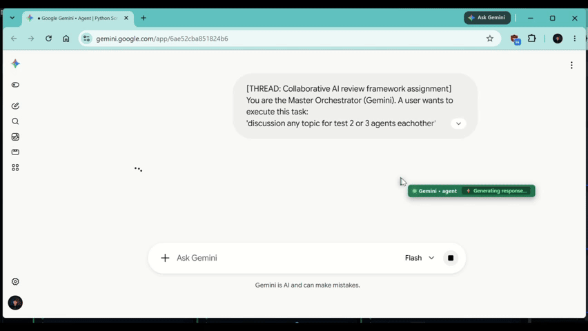

---

## ⚡ Comprehensive Platform Features Roster (One-Liner Overview)

### 👑 1. Multi-Agent Hierarchy & Dynamic Leadership
* **👑 Dynamic Master Leader Transfer**: Dynamically promote any custom model to Master Orchestrator, automatically moving Google Gemini into the specialist roster as a multimodal evaluator.
* **🤖 10+ Synchronized AI Specialists**: Parallel coordination across Gemini, DeepSeek, ChatGPT, Claude, Meta AI, DALL-E 3, Perplexity, Copilot, Nvidia NIM AI, and Mistral.
* **🧩 Autonomous Mission Decomposition**: Decomposes high-level user goals into structured, parallelizable subtasks with automatic dependency routing.
* **⚙️ Dynamic Custom Agent Registration**: Add custom AI models on the fly directly in Settings via JSON, Python dicts, or key-value text schemas.
* **📊 Real-Time Agent State Synchronization**: Live tracking of worker operational states (`FREE`, `BUSY`, `LEADER`, `ERROR`) backed by persistent SQLite WAL storage.
* **🔍 Agent Activity & Task Inspector**: Deep-inspect live prompt context, active tool executions, and force-reset stuck or busy workers with a single click.

### 🖱️ 2. Dynamic Collaborative Agent Cursors & Browser Automation
* **🎨 Template-Driven Collaborative Cursors**: Visual cursor templates featuring custom colored pointers, gradient badges, pulsing status dots, and active icons per agent.
* **🏷️ Live Worker Action Chips**: Dynamic in-browser badges displaying what each specialist is doing in real time (e.g. *"Deep Thinking & Coding..."*).
* **🖥️ Desktop System Cursor Overlay**: PySide6 desktop-level tracking overlay visualizing multi-agent screen interactions in real time.
* **🌐 Chrome CDP Automation Engine**: Direct Playwright Chrome DevTools Protocol automation via port `9222` with session reuse and DOM control.
* **👁️ Multi-Agent Tab HUD & Window Focus**: Collaborative browser HUD with 1-click tab switching, active worker indicators, and instant window focus triggers.
* **📸 Automated Milestone Screenshot Capture**: Captures high-resolution browser verification screenshots and downloads client assets automatically.

### 💎 3. Multi-Model Token Manager & Free Daily Quotas
* **⚡ 1.019B+ Daily Free Tokens Pool**: Aggregates and tracks over 1.019 Billion free daily tokens across 8 leading AI providers.
* **📈 Lifetime Usage Telemetry ('Till Today')**: Real-time tracking of cumulative lifetime tokens consumed since project inception with audit logs.
* **📊 7-Day Consumption Trend Charts**: Interactive visual bar charts comparing historical daily usage trends across models.
* **🍩 Provider Share Distribution Donuts**: Graphical breakdown visualizing exact token consumption proportions per AI provider.
* **⏰ Midnight UTC Quota Reset Countdown**: Real-time countdown timer automatically resetting daily provider quotas at `00:00 UTC`.
* **📥 1-Click Ledger CSV Export**: Export complete transaction records, model usage, timestamps, and cost estimates to CSV with a single click.

### 🔌 4. Model Context Protocol (MCP) & Senior Engineering Skills
* **🛠️ 24 Senior Engineering Skills**: Inbuilt integration with Addy Osmani Senior Skills (Spec-Driven Development, TDD, Architectural Review, A11y, Security Audits).
* **📋 Standardized 9-Field MCP Registry**: Centralized schema-validated tool management for server health monitoring and dynamic tool execution.
* **🚀 CitroLabs Ego-Lite Parallel Browser**: Isolated Chromium execution spaces for high-speed multi-agent web navigation and data harvesting.
* **🧪 Interactive Tool Execution Console**: Live interactive UI forms for testing MCP tool calls, inspecting schemas, and verifying JSON responses.

### 🌌 5. Autonomous Infinite Canvas IDE (DAG Workflow Architecture)
* **🗺️ 2D Infinite Graph Workspace**: Visual DAG-based node canvas for designing, connecting, and orchestrating complex multi-agent software pipelines.
* **💻 Embedded Terminal / CLI Nodes**: Live command-line nodes with real-time streaming output, ANSI color support, and exit code monitors.
* **🤖 Autonomous Agent Nodes**: Interactive LLM worker nodes displaying objective prompts, live tool outputs, and step-by-step reasoning.
* **📄 Git-Style Unified Diff Nodes**: Visual side-by-side and inline diff viewers with green addition / red deletion highlighting and instant save triggers.
* **⚡ Bézier Context Bridge Wires**: Directed visual data pipelines streaming terminal stdout, agent context, and file diffs seamlessly across nodes.

### 💻 6. Inbuilt Monaco VS Code Studio & Live Sandbox
* **📝 Embedded Monaco Code Editor**: Full-featured code editor supporting 12+ programming languages with syntax highlighting and auto-completion.
* **🪟 Dual-Pane Live Preview**: Split-screen live rendering for web deliverables (HTML/CSS/JS) and markdown documentation side-by-side.
* **📂 Project File Explorer & Tabs**: Multi-tab workspace manager with rapid file creation, deletion, renaming, and auto-save capabilities.
* **🧪 Python & Web Execution Sandboxes**: Isolated safe execution playground for testing generated Python scripts and frontend bundles.

### 🧠 7. Semantic Neural Memory Bank & Knowledge Vault
* **🧠 Persistent Cross-Mission Memory**: Centralized knowledge store preserving architectural decisions, design conventions, and prompt refinements across tasks.
* **🏷️ Semantic Categorization & Star Ratings**: Multi-tier categorization (Architecture, Conventions, Fixes) with star ratings and pin priorities.
* **🔎 Instant Memory Search & Filter**: Rapid keyword and semantic search engine to instantly retrieve past project solutions and patterns.
* **📑 1-Click `RULES.md` & `GEMINI.md` Exporter**: Compiles verified project rules directly into workspace instruction files for AI coding agents.

### 🛡️ 8. Enterprise Security, Sandbox & Error Handling
* **🔒 Dual-Mode Execution Sandbox**: Execute commands safely inside isolated Docker containers or local restricted subprocess sandboxes.
* **🛡️ Security Guard Command Scanner**: Pre-execution security barrier intercepting and blocking hazardous commands, leaks, and unauthorized writes.
* **🐙 Autonomous GitHub Issue & Crash Dispatcher**: Intercepts unhandled app exceptions, sanitizes sensitive tokens, and files structured GitHub issues automatically.
* **⚡ Resilient API Gateway**: Token bucket rate limiting, circuit breaker failover matrix, and exponential backoff with jitter to eliminate API dropouts.

### 🎙️ 9. Gemini Live Voice Bridge & Hardware Control
* **🎙️ Real-Time Bidirectional Voice**: High-speed ASGI and WebSocket bridge connecting Gemini 2.0 Live audio streaming for hands-free operations.
* **🚀 Native Windows App Launcher**: Zero-latency direct launching of desktop system utilities (`Notepad`, `Task Manager`, `Calc`, `VS Code`, `Settings`).
* **📐 Microsoft PowerToys FancyZones Tiling**: Automatic zero-overlap 3-column desktop layout snapping via native Windows Win32 APIs.

### ⚡ 10. LAYA System 1 Non-Autoregressive Decision Engine (<40ms)
* **⚡ Sub-40ms Deterministic Forward Pass**: Evaluates user ingress prompts and plugin tool calls using typed decision contracts without generative LLM token delay.
* **🎯 3 Typed Decision Primitives**: Native `choice` (categorical specialist partitioning), `score` (execution urgency & depth tier), and `noul` (binary hypotheses for security boundaries & System 2 fallback).
* **🔒 Calibrated Probabilistic Confidence Gating**: Threshold-based fast-path auto-execution ($\ge 0.85$) with zero JSON schema drift, automatically escalating ambiguous tasks to System 2 Chain-of-Thought deliberation (Gemini / DeepSeek-R1).
* **🛡️ Plugin Tool Gatekeeping & Sandbox Isolation**: Intercepts plugin tool executions, analyzes privilege tiers, and enforces subprocess sandboxing for elevated system actions.

### 🎭 11. The Agency: 287+ Specialized AI Agents Roster (18 Divisions)
* **🤖 287+ Production-Grade Specialists**: Battle-tested domain expert personas across 18 core divisions (*Engineering, Security, Design, Marketing, Game Dev, GIS, Healthcare, Product, Testing, Spatial Computing, Finance, Academic, and Specialized*).
* **🔍 Interactive GUI Catalog & Inspector**: Dedicated PySide6 split-screen browser in Squad Roster with instant fuzzy search, division filtering, and full Markdown persona inspection.
* **🚀 1-Click Squad Assembly & Deployment**: Auto-formats mission tasks, injects authentic specialist vibes & quality rules, and preselects optimal AI models for instant execution.
* **🧩 Runtime Persona & DAG Node Injection**: Dynamically inject specialist directives into LLM prompt chains, Expert Co-op memory contexts, and Infinite Canvas DAG nodes.

### 📦 12. Developer Experience & Portable Distribution
* **⚡ Live Auto-Reload Engine (`dev.py` / `dev.bat`)**: Intelligent change debouncer and process tree terminator that auto-restarts the app on `Ctrl+S`.
* **📦 Single-File Portable Executable (`STD_EXE.py`)**: 1-click builder compiling the entire desktop suite into a standalone Windows `.exe` without requiring Python.
* **🐳 Docker Compose Containerization**: 1-command reproducible multi-platform environment setup passing X11/Wayland display sockets.

---

## 🌟 Key Architecture & Capabilities

### 🏗️ Enterprise Platform Architecture

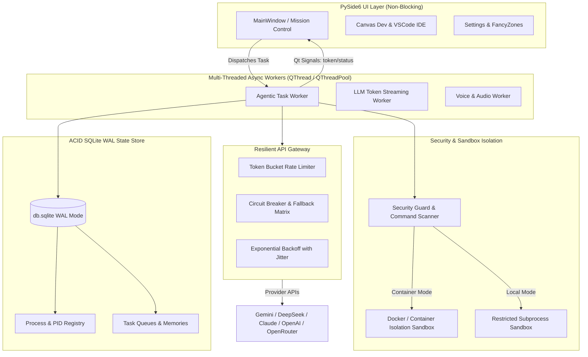

### 👑 1. Multi-Agent Command Hierarchy (10 Active Models)
- **👑 Master Leader & Orchestrator:**
  - **Google Gemini**: Decomposes user missions into atomic subtasks, assigns work equally across available specialist models, and conducts final editorial approval.
- **🔬 Research & Technical Computing Cluster:**
  - **DeepSeek**: Creative ideation, algorithmic design, and test-driven code implementation.
  - **Perplexity AI**: Real-time factual citations and live web knowledge verification.
  - **Nvidia NIM AI**: High-performance GPU compute advisor and web performance profiling.
- **✍️ Content, Copy & Editorial Cluster:**
  - **OpenAI ChatGPT (GPT-4o)**: Campaign synthesis, client copywriting, and document packaging.
  - **Anthropic Claude**: Editorial review, security boundary auditing, and accessibility audits.
  - **Mistral Le Chat**: European multilingual translation and logic verification.
- **🎨 Creative, Media & Operations Cluster:**
  - **Meta AI**: Viral trend analysis and platform engagement optimization.
  - **OpenAI DALL-E 3**: Graphic asset design, composition, and visual prompt engineering.
  - **Microsoft Copilot**: Enterprise workflow coordination and office document integration.

---

## 🔌 2. Model Context Protocol (MCP) & Claude AI Skills Engine
- **🧠 Claude AI Dynamic Skills Ingestor (`skills/`)**:
  - Ingest, parse, and store skills (`SKILL.md` / `*.md`) from **any GitHub repository URL**, local markdown file, or live prompt editor.
  - Automatically indexes metadata, triggers, and rules into `json/skills_registry.json`.
  - **Dynamic Runtime Prompt Injection**: Automatically matches relevant skills for any user goal and embeds instructions into active LLM pipelines (Gemini, Claude, DeepSeek, ChatGPT).
- **Addy Osmani Senior Skills (`https://github.com/addyosmani/agent-skills.git`)**:
  - Live remote integration connecting 24 senior engineering skills (Spec-Driven Development, TDD, Architectural Review, Code Simplification, Security & A11y Audits).
- **CitroLabs Ego-Lite Parallel Browser (`https://github.com/citrolabs/ego-lite.git`)**:
  - Isolated Chromium spaces, authenticated Chrome session reuse, and high-speed CDP DOM extraction.
- **Standardized 9-Field Schema**:
  - All MCP configurations in `json/mcp_config.json` conform strictly to the 9-field schema (`name`, `repository`, `api_endpoint`, `raw_base_url`, `version`, `skills_count`, `status`, `type`, `description`).

---

## 🎭 3. The Agency: 287+ Specialized AI Agents (18 Divisions)
- **Roster & Taxonomy**: Complete catalog of 287+ battle-tested AI specialist personas across 18 specialized divisions (*Engineering, Security, Design, Marketing, Game Dev, GIS, Healthcare, Product, Testing, Spatial Computing, Finance, Academic, and Specialized*).
- **Interactive Visual Inspector**: Dedicated PySide6 split-screen browser in **Squad Roster** to filter by division, search keywords, and inspect full Markdown persona instructions, code deliverables, and rules.
- **1-Click Squad Assembly & Dispatch**: Selecting an agent auto-formats mission directives, injects authentic domain vibes, and preselects optimal AI models (Gemini, DeepSeek, Claude, ChatGPT, DALL-E 3) for instant deployment.
- **Dynamic Directive Injection (`core/agency_agents_manager.py`)**: Seamlessly resolves specialist rules, constraints, and quality standards for active LLM pipelines and Infinite Canvas DAG nodes.

---

## 🖥️ 4. Futuristic PySide6 Desktop Console
- **🛰️ Mission Control (Home):** Interactive telemetry cards (`Tasks Completed`, `Memory Items`, `Squad Roster`, `Agent Skills`, `Assets Saved`, `Active Missions`), Gemini Direct Task Dispatcher, and real-time Multi-Agent Hierarchy Monitor.
- **🌳 Agent Command Hierarchy Tree:** Switchable tree & grid view with Gemini Leader at the root branching into the specialist clusters with live `🟢 FREE` vs `🟡 BUSY` indicators and agent activity inspector.
- **🚀 Task Dispatch Console:** Custom agent loop selector, latency & communication speed tuner, real-time streaming log terminal, and process manager.
- **🎮 Playground Studio:** Live HTML/CSS/JS sandbox with real-time deliverable preview, isolated Python execution sandbox, and task code extractor.
- **🤖 Agent Squads & Agency Agents Roster:** Browse 287+ specialized AI agents across 18 divisions, inspect personas & deliverables in a split-screen modal, 1-click squad auto-synthesizer, fast presets, and repeated pattern auto-learner.
- **📋 Mission Archive:** Searchable mission history with 5 deep inspection tabs (Gemini Plan, Worker Outputs, Final Approved Result, Live Sandbox, Downloaded Assets) and full-resolution screenshot lightboxes.
- **🔌 MCP Service Hub:** Live tool tester with dynamic parameter forms, server registry, parameter schema explorer, and custom server registration.
- **🧠 Neural Memory Vault:** Cross-mission factual memory search, semantic categorization, importance rating, pin priority, deduplication, and `RULES.md` exporter.
- **💎 Multi-Model Token Manager & Free Quota Console:** Tracks cumulative lifetime token consumption ('till today'), model-specific free daily quotas (Gemini 1B, DeepSeek 5M, Claude, ChatGPT, Groq 14.4k RPD, OpenRouter Free), 7-day consumption trend charts, model distribution donuts, and 00:00 UTC quota reset timers.
- **🐙 Autonomous GitHub Issue & Crash Dispatcher:** Intercepts unhandled app exceptions and crashes, strips secret credentials, computes a fingerprint hash, and automatically files structured issues or recurrence comments directly to [MaxMasAI/agentic-web/issues](https://github.com/MaxMasAI/agentic-web/issues).

---

## 🌌 4. Autonomous Infinite Canvas IDE (DAG Workflow Architecture)

An interactive 2D infinite workspace for autonomous multi-agent development workflows:

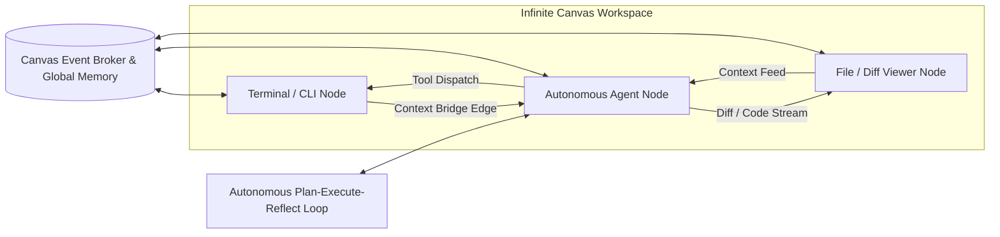

- **Interactive Node System**:
  - `🖥️ Terminal / CLI Node`: Embedded live shell running command-line workflows with exit code indicators and real-time stream output.
  - `🤖 Autonomous Agent Node`: Autonomous LLM worker with objective input, dynamic status badges (`IDLE`, `PLANNING`, `EXECUTING`, `PAUSED`, `ERROR`), and tool execution feeds.
  - `📄 File / Diff Viewer Node`: Unified git-style diff viewer (`+` green additions, `-` red deletions) with live code editing and save triggers.
  - `⚡ Context Bridge (Bézier Wires)`: Directed data pipelines linking terminal output streams, agent context buffers, and file diff emitters.
- **Autonomous Tool-Calling Loop**:
  - `run_command(cmd)`: Dispatches execution to connected CLI terminal nodes.
  - `read_file(path)` / `write_file(path, content)`: Updates workspace storage and emits live diffs to connected File nodes.
  - `spawn_node(type, props)`: Dynamically adds dependent sub-agents or utility nodes directly onto the canvas.


## 📸 Visual Interface & Platform Showcase

### 🛰️ 1. Mission Control Dashboard
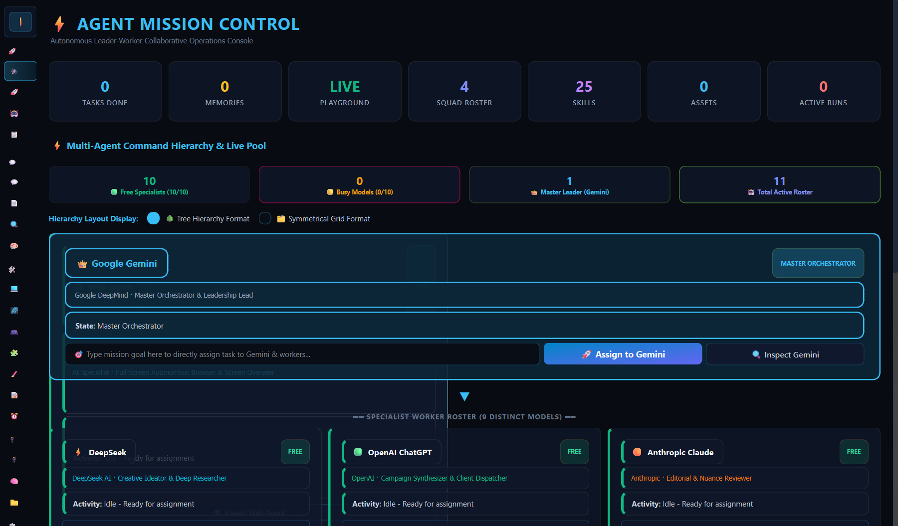
* **Clarification**: Central telemetry command center providing real-time metrics (`Tasks Completed`, `Memory Items`, `Squad Roster`, `Agent Skills`, `Active Missions`), multi-agent command hierarchy status, and 1-click quick-action dispatchers.

---

### 🚀 2. Task Dispatch Console & Live Telemetry Monitor
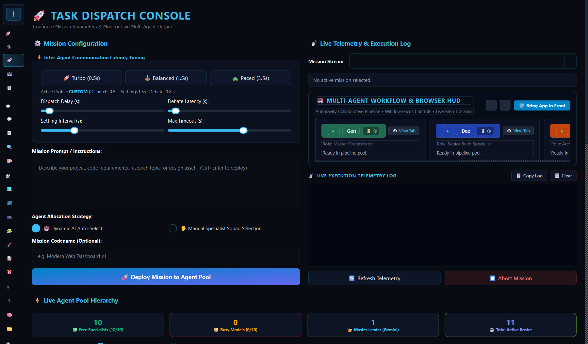
* **Clarification**: Configure mission parameters, tune inter-agent communication latency (Turbo, Balanced, Paced, or Custom sliders), inspect real-time multi-agent streaming terminal output, and manage active background processes.

---

### 💻 3. Inbuilt VS Code Monaco Studio & Live Preview
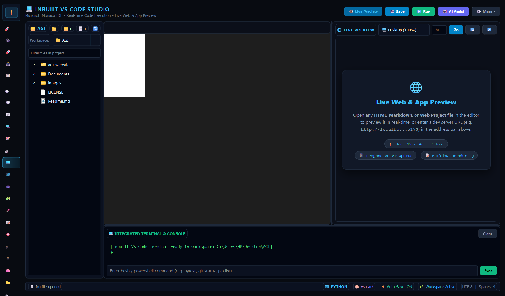
* **Clarification**: Embedded full-featured Monaco Code Studio with multi-tab file management, project directory tree, dual-pane live web & markdown preview, syntax highlighting for 12+ languages, auto-save, and formatting controls.

---

### 🌌 4. Autonomous Infinite Canvas IDE (DAG Workflow Architecture)
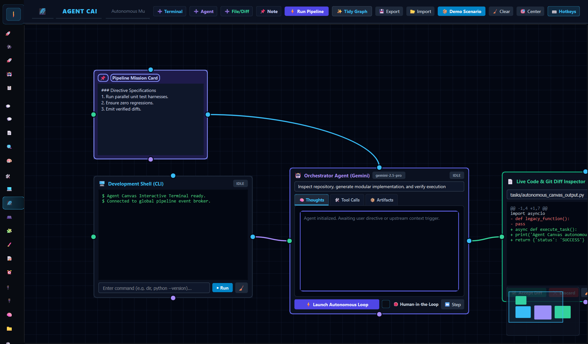
* **Clarification**: Interactive 2D infinite workspace connecting Terminal CLI nodes, Autonomous Agent workers, and Git-style Diff nodes via directed Bézier context wires for complex multi-agent pipelines.

---

### 🔌 5. Model Context Protocol (MCP) Server Hub
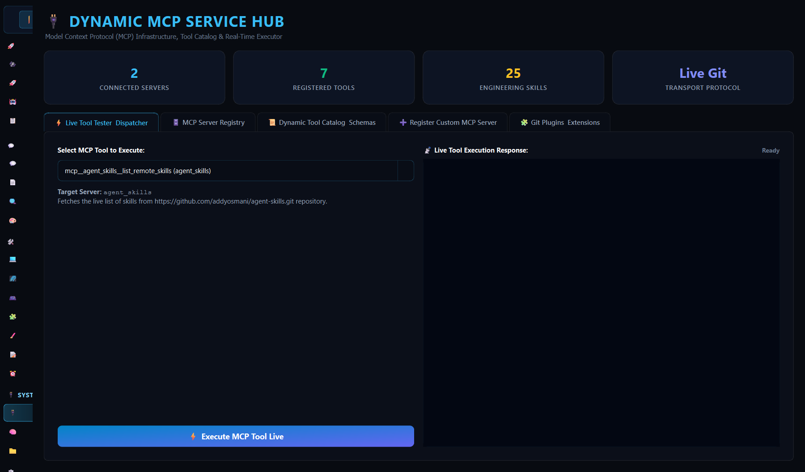
* **Clarification**: Centralized MCP server management interface with live tool parameter execution testing, 9-field JSON schema verification, and dynamic connection to Addy Osmani Senior Engineering Skills.

---

### 🧠 6. Semantic Neural Memory Bank & Knowledge Vault
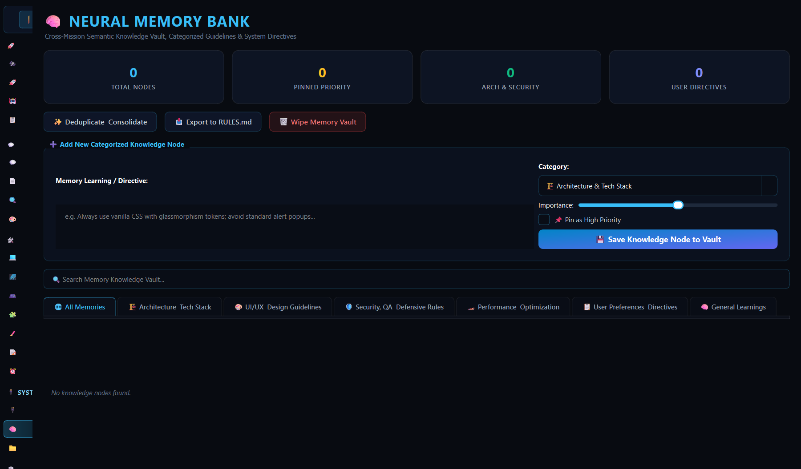
* **Clarification**: Persistent cross-mission memory bank storing key architectural decisions, design conventions, and prompt refinements with search, categorization, importance weighting, and `RULES.md` export.

---

### 🌐 7. Multi-Agent Browser Automation & Window Focus Controls
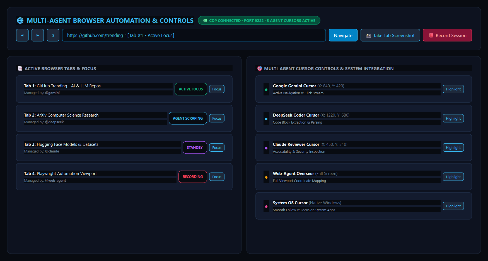
* **Clarification**: Real-time multi-agent browser viewport and session control center featuring live CDP connection indicators, active browser tab switchers with window focus buttons, multi-agent cursor trackers (Gemini, DeepSeek, Claude, Web-Agent, and OS System Cursor), live screenshot capture triggers, and session recording tools.

---

### 🤖 8. Live Collaborative Multi-Agent Workflow & Window Focus HUD
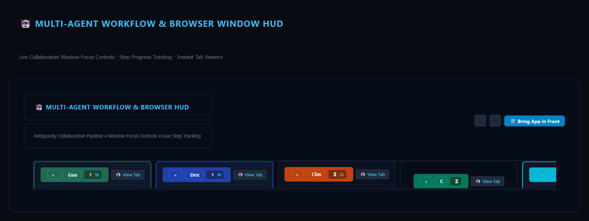
* **Clarification**: Real-time collaborative pipeline HUD visualizing all active agent pills, execution status badges (`Working...`, `Done`, `Queued`), smooth horizontal card navigation, and 1-click `👁️ View Tab` window focus controls.

---

### 💎 9. Multi-Model Token Manager & Free Quota Analytics Dashboard
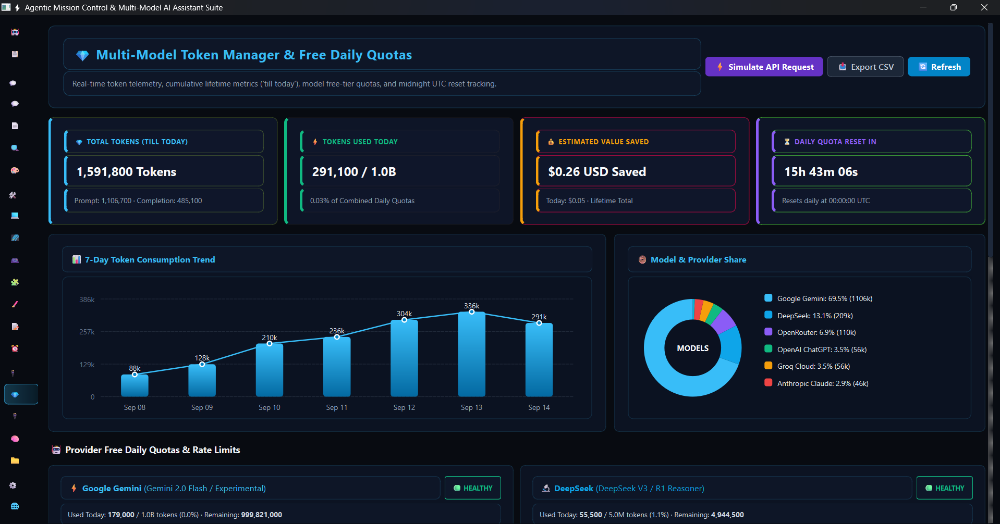
* **Clarification**: Comprehensive token telemetry dashboard displaying cumulative lifetime usage metrics ('till today'), provider-specific free daily quotas (Gemini 1B, DeepSeek 5M, Claude, ChatGPT, Groq 14.4k RPD, OpenRouter Free), 7-day consumption trend bar charts, model distribution donut graphs, live midnight UTC quota reset countdowns, and granular transaction ledgers with 1-click CSV export.

| Provider & Model | Free Daily Quota / Limit | Reset Schedule | Telemetry & Auto-Routing |
|---|---|---|---|
| <br>**Google Gemini 2.0 Flash** | **1,000,000,000 tokens / day** | 00:00 UTC | Automatic token bucket rate limiting & ledgering |
| <br>**DeepSeek-V3 / R1** | **5,000,000 tokens / day** | 00:00 UTC | SQLite WAL transaction audit trail |
| <br>**OpenRouter Free Tier** | **10,000,000 tokens / day** | 00:00 UTC | Model share donut visualization |
| <br>**Groq (Llama-3.3-70B)** | **14,400 RPD / 500,000 tokens** | 00:00 UTC | High-speed burst rate limiter |
| <br>**OpenAI GPT-4o-mini** | **2,500,000 tokens / day** | 00:00 UTC | Circuit-breaker failover matrix |
| <br>**Anthropic Claude 3.5 Sonnet** | **100,000 tokens / day** | 00:00 UTC | 7-day historical usage trend chart |
| <br>**HuggingFace Inference API** | **1,000,000 tokens / day** | 00:00 UTC | Token quota percentage progress bars |
| <br>**Perplexity Sonar Web Search** | **500,000 tokens / day** | 00:00 UTC | Live search verification token tracker |

---

## 📁 Directory Structure

| Directory | Purpose |
|---|---|
| **`gui/`** | PySide6 Desktop UI architecture (Theme, Widgets, Pages). |
| **`json/`** | Centralized storage for MCP configs, agent status, squads, memories, and PID queues. |
| **`tasks/`** | Historical task archives, subtask breakdowns, debate logs, and deliverables. |
| **`logs/`** | Real-time console logs, telemetry streams, and system diagnostics. |
| **`downloads/`** | Generated images, code bundles, and client assets auto-downloaded from agents. |
| **`visuals/`** | Browser verification screenshots captured at each execution milestone. |
| **`tests/`** | Automated unit tests for MCP services, agent status, and skills router. |

---

## 📋 System & Dependency Requirements

### 💻 Supported Platforms & Environments
| Component | Minimum Required | Recommended | Notes |
|---|---|---|---|
| **Python** | `Python 3.10` | `Python 3.12` | Fully tested on 3.10, 3.11, 3.12, 3.13 |
| **Operating System** | `Windows 10 / 11 (64-bit)` | `Windows 11 Pro 64-bit` | macOS 12+ and Ubuntu 22.04+ (X11/Wayland) supported |
| **Memory (RAM)** | `4 GB RAM` | `8 GB – 16 GB RAM` | Needed for concurrent multi-model parallel browser tasks |
| **Storage** | `500 MB Free Disk Space` | `SSD / NVMe` | For SQLite WAL storage, cache, and downloads |
| **Layout Manager** | *None (Native fallback)* | `Microsoft PowerToys v0.80+` | For automatic FancyZones 3-column zero-overlap tiling |
| **Node.js (Optional)** | `Node.js v18+` | `Node.js v20 LTS` | Required only for external Node MCP server tools |
| **Docker (Optional)** | *None (Local Sandbox)* | `Docker Desktop v24+` | For containerized execution sandbox mode |

### 📦 Key Python Dependencies (`requirements.txt` / `requirements.lock`)
| Package | Version | Purpose |
|---|---|---|
| **`pyside6`** | `==6.10.1` | Native PySide6 Qt6 GUI framework, dark theme, and widgets |
| **`google-genai`** | `==1.75.0` | Google Gemini 2.0 Flash / Pro Live streaming and SDK integration |
| **`fastapi`** / **`uvicorn`** | `==0.141.1` / `==0.52.4` | High-speed ASGI server for Gemini Live Voice & Audio websocket bridge |
| **`playwright`** | `==1.58.0` | Resilient browser automation, CDP fallback, and DOM interaction |
| **`httpx`** / **`requests`** | `==0.28.1` / `==2.34.2` | Async/sync HTTP clients with retry and circuit-breaker backoff |
| **`watchdog`** | `>=4.0.0` | Live development runner filesystem event watcher (`dev.bat` / `dev.py`) |
| **`pywin32`** | `==312` | Win32 DPI awareness, SetWindowPos, and FancyZones window snapping |
| **`sounddevice`** / **`numpy`** | `==0.5.3` / `==2.5.2` | Real-time live audio recording and speech streaming |
| **`websockets`** | `==14.1` | Low-latency bi-directional voice streaming protocol |

---

## 🚀 Quick Start & Installation via GitHub

### 1. Clone the Repository
```bash
git clone https://github.com/MaxMasAI/agentic-web.git
cd agentic-web
```

### 2. Create & Activate Python Virtual Environment (`.venv`)
> [!TIP]
> Always create an isolated virtual environment to prevent dependency conflicts with system packages.

#### On Windows (PowerShell / Command Prompt):
```powershell
# Create the virtual environment
python -m venv .venv

# Activate the virtual environment
.venv\Scripts\activate

# Upgrade pip and install all dependencies
python -m pip install --upgrade pip
pip install -r requirements.txt
```

#### On macOS & Linux (Bash / Zsh):
```bash
# Create the virtual environment
python3 -m venv .venv

# Activate the virtual environment
source .venv/bin/activate

# Upgrade pip and install all dependencies
python -m pip install --upgrade pip
pip install -r requirements.txt
```

*(Alternatively, Windows users can simply run `install.bat` and Unix users can run `./install.sh` to automate this entire process).*

---

### 3. Launch the Application

> [!TIP]
> **💡 Launcher Recommendation:**
> - **If you are coding / customizing**: Double-click **`dev.bat`** (Live Auto-Reload mode: automatically restarts on `Ctrl+S`).
> - **If you are just using the app**: Double-click **`run.bat`** (Standard run mode with Gemini Voice daemon).

#### Launch Full Suite (Voice Server Daemon + PySide6 Desktop GUI):
```cmd
run.bat
```

#### Launch Desktop GUI Directly:
```bash
python app.py
```

#### ⚡ Live Auto-Reload Development Engine (`dev.py` & `dev.bat`):
For active feature development and UI customization, the platform includes an intelligent live-reloading engine that monitors all `*.py` files and restarts the application automatically when code is saved.

```bash
# 🖥️ Auto-reloads Desktop GUI (app.py) on code changes (Default)
python dev.py

# 💻 Auto-reloads CLI Multi-Agent Orchestrator (main.py) on code changes
python dev.py --cli

# ⏱️ Custom debounce settling delay (e.g., wait 2.0s for multi-file IDE edits to settle)
python dev.py --delay 2.0

# 🪟 Windows 1-Click Dev Launcher
dev.bat
```

##### 🛠️ How `dev.py` & `dev.bat` Work:
* **Smart Change Debouncing**: Rather than restarting immediately on every intermediate file touch, `dev.py` buffers changes and waits for file edits to settle (default `1.2s`), avoiding repeated jittery restarts during multi-file saves.
* **Clean Process Tree Termination**: Uses `taskkill /F /T /PID` on Windows (and `SIGTERM` process group cleanup on Unix) to recursively terminate child processes, preventing zombie processes, leaked sockets, or port `9222`/`8000` collisions.
* **Dual Watcher Architecture**: Automatically uses high-performance OS file system events via `watchdog` when available, with a fallback to an internal zero-dependency file polling engine.
* **1-Click Batch Integration (`dev.bat`)**: Configures terminal styling and forwards all command-line flags directly to `dev.py`.

---

### 4. Run Test Suites
```bash
python -m unittest discover tests
```

## 🐳 5. Run with Docker Compose
If you prefer containerized execution, you can run the app seamlessly using the provided `docker-compose.yml`.

```bash
docker compose up --build
```
*(Note: Since this is a GUI application, it automatically passes your host's X11 server socket. This is primarily supported on Linux/WSL).*

---

## 📦 6. Build Standalone Executable
You can easily compile Agentic Web into a standalone, portable Windows executable (`.exe`) that doesn't require Python or virtual environments!

1. Open your terminal in the project root.
2. Run the executable builder:
```bash
python STD_EXE.py
```
3. Your portable app will be generated in `dist/agentic-web/`. You can simply double-click `agentic-web.exe` to start the dashboard!

---

## ⚙️ Configuration & Agent Roster Customization

- **`json/agent_status.json` / `json/subagents.json`**: Configure default squad models, fallback chains, temperature profiles, and prompt instructions.
- **Hierarchy Switcher**: Toggle between **Tree Hierarchy Format** and **Symmetrical Grid Format** directly from the UI header to optimize display for your monitor size.
- **System App Launcher**: Directly launch native Windows desktop utilities (`notepad`, `task manager`, `calc`, `vscode`, `settings`) without triggering search fallbacks.

---

## ❓ Frequently Asked Questions (FAQ)

### 🌐 General & Architecture

* **What is Agent Mission Control?**  
  It is a desktop operations console and dashboard designed to orchestrate, monitor, and synchronize autonomous multi-model AI workflows (Gemini, DeepSeek, Claude, ChatGPT, and Local LLMs) from a single unified interface.

* **How does the Leader-Worker agent hierarchy work?**  
  The system designates a primary model (e.g., Google Gemini as Master Orchestrator) to analyze complex prompts, decompose objectives into atomic subtasks, and dispatch them to specialized worker agents (like DeepSeek for deep research/code, Claude for editorial nuance, and ChatGPT for copywriting).

* **Can I run tasks across multiple browser sessions and API calls simultaneously?**  
  Yes. The application supports real-time multi-agent live pooling, split-pane DOM browser automation (via Chrome CDP on port 9222), and concurrent headless API endpoints, allowing parallel execution across distinct AI providers.

---

### 🔑 Setup & Configuration

* **Do I need API keys or web sessions to run the agents?**  
  The app supports both direct API credentials and session-based browser automation (e.g., DOM-level agent control and n8n hooks). You can use session-based interaction without requiring paid API tokens when logged into web instances, or configure provider API keys in the Settings tab.

* **How do I customize agent roles, default squads, and permissions?**  
  Navigate to the **Squad Roster** or **Hierarchy Layout** view. From there, you can configure each model’s operational state (`FREE` / `BUSY`), system prompts, tool execution permissions, and task-delegation rules.

* **Does the application support local, self-hosted LLMs?**  
  Yes. You can attach local endpoint providers (such as Ollama, LM Studio, or vLLM) alongside cloud-based models in the Specialist Worker Roster for fully offline or air-gapped tasks.

---

### 🔒 Security, Controls & Safety

* **How does the system prevent prompt injection, drift, and hallucination during tool execution?**  
  The orchestrator employs intermediate confidence-scoring mechanisms and validation barriers before allowing worker agents to commit external actions like database writes, file modifications, terminal command execution, or pull request merges.

* **What should I do if an agent gets stuck in an infinite or "Busy" loop?**  
  Select the agent card directly from the **Live Pool**, click **Inspect**, and use the **Force Reset State to FREE** trigger to safely release the worker back to the ready pool.

---

## 🔧 Troubleshooting Matrix

| Issue | Root Cause | Recommended Solution |
|---|---|---|
| **App window is blank / white screen** | Dev server or UI thread initialization delay | Run with `run.bat` or `python app.py`. Ensure PySide6 and dependencies are installed in `.venv`. |
| **Agent shows `BUSY` indefinitely** | Network timeout or unhandled exception during browser automation | Open the **Inspector Drawer** on the agent card in Mission Control and click **Force Reset State to FREE**. |
| **Local endpoint connection refused** | Ollama / vLLM / LM Studio service is not running | Verify the local daemon is active (e.g. `curl http://localhost:11434/api/tags`). |
| **Chrome CDP connection retry notice** | Remote debugging port 9222 waiting to spin up | The app automatically launches Chrome with `--remote-debugging-port=9222` and retries connection automatically. |

---

## 🤝 Contributing
Contributions are welcome! Please fork the repository, create your feature branch (`git checkout -b feature/agent-telemetry`), commit your changes, and submit a pull request.

---

## 👥 Organization & Ownership

- **Organization**: [MaxMasAI](https://github.com/MaxMasAI)
- **Founder & Owner**: [Sahil Kumar Dhala](https://github.com/Sahilkumardhala)
- **License**: Released under the open-source [MIT License](LICENSE).

*© 2026 MaxMasAI. All rights reserved.*


